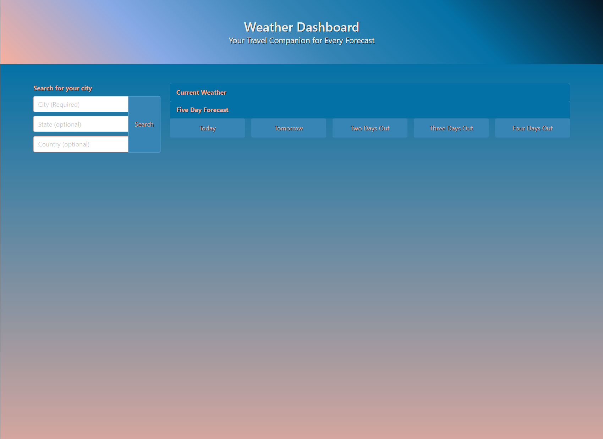
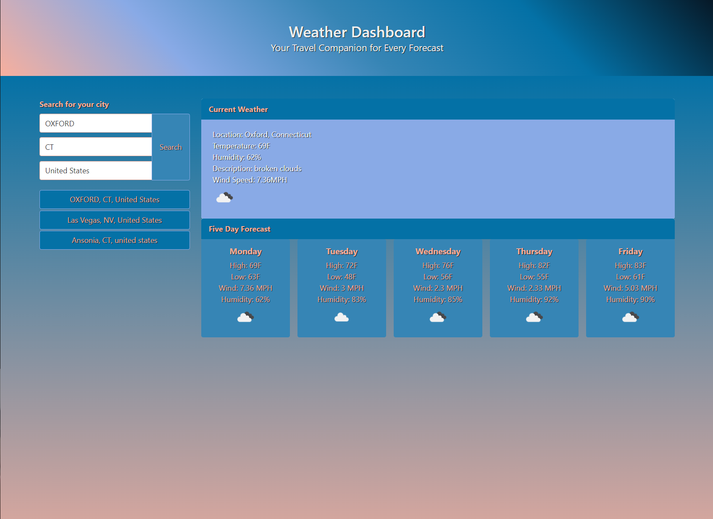

# Weather Dashboard Project (Week 6)

## What is This Project?

This week's project is a Weather Dashboard application designed to provide current and future weather conditions for multiple cities.

- **Why Did I Make This?**: This project was created to practice and enhance my skills in JavaScript, specifically working with APIs and dynamically updating HTML based on API responses. I built a useful application that could provide real-time weather information. This project also served as an opportunity to dive deeper into handling asynchronous JavaScript operations and managing data with localStorage.
- **What's in It?**: This application features a search bar where users can input a city name, and optionally a state and/or country (because my town returned a city in England, I felt compelled to get these extra parameters working), to fetch and display current weather conditions and a five-day weather forecast. The weather data includes temperature, humidity, wind speed, and a weather icon representing the conditions. It also keeps a search history, allowing users to quickly access weather data for previously searched cities. The user interface is designed to be intuitive and responsive, and give a vibe of different times of the day using the palette choice I came up with (thanks to Coolors.co!).
- **What Did I Learn?**: I learned a lot about how to integrate third-party APIs, specifically OpenWeather's APIs, and handle asynchronous JavaScript operations using fetch. I gained experience in manipulating the DOM to dynamically update the content based on API responses. The project also reinforced the importance of debugging and constantly adding console.logs for testing (I don't think I removed all of them even lol). Additionally, I learned how to use the Day.js library for date manipulation, specifically with Unix timestamps, and effectively manage data using localStorage to persist user search history across sessions.

## Table of Contents

Explore the contents of this guide:

- [Installation](#installation)
- [Usage](#usage)
- [Screenshots](#screenshots)
- [Credits](#credits)
- [License](#license)

## Installation

No installation is required:
1. Open up the page on your favorite browser: [Weather Dashboard Project](https://kitkatkernel.github.io/Weather-Dashboard/)

## Usage

1. Use the form to search for a city's weather conditions.
2. View current weather conditions including city name, date, temperature, humidity, wind speed, and a weather icon.
3. View a five-day weather forecast displaying the date, high and low temperatures, wind speed, humidity, and a weather icon.
4. Click on a city in the search history to display current and future weather conditions for that city.
5. Weather data is saved in localStorage and will be re-rendered between page reloads.

## Screenshots

#### Main Page

#### Weather Information

## Credits

I would like to extend my gratitude to my bootcamp peers for their continuous support and guidance throughout this project. Special thanks to the following resources:

- [W3Schools](https://www.w3schools.com/) for their tutorials and references.
- [MDN Web Docs](https://developer.mozilla.org/) for their comprehensive documentation on web technologies, especially the articles on [fetch API](https://developer.mozilla.org/en-US/docs/Web/API/Fetch_API) and [localStorage](https://developer.mozilla.org/en-US/docs/Web/API/Window/localStorage).
- [Day.js](https://day.js.org/docs/en/display/unix-timestamp-milliseconds#docsNav) for their great documentation, which was very helpful for setting current weather.
- [Stack Overflow](https://stackoverflow.com/) for being an invaluable resource for troubleshooting and finding solutions to coding issues that people have already asked.
- [OpenWeather API](https://openweathermap.org/api) for providing the weather data that powers this application and their great documentation.

## License

MIT License 

Permission is hereby granted, free of charge, to any person obtaining a copy of this software and associated documentation files (the "Software"), to deal in the Software without restriction, including without limitation the rights to use, copy, modify, merge, publish, distribute, sublicense, and/or sell copies of the Software, and to permit persons to whom the Software is furnished to do so, subject to the following conditions:

The above copyright notice and this permission notice shall be included in all copies or substantial portions of the Software.

THE SOFTWARE IS PROVIDED "AS IS", WITHOUT WARRANTY OF ANY KIND, EXPRESS OR IMPLIED, INCLUDING BUT NOT LIMITED TO THE WARRANTIES OF MERCHANTABILITY, FITNESS FOR A PARTICULAR PURPOSE AND NONINFRINGEMENT. IN NO EVENT SHALL THE AUTHORS OR COPYRIGHT HOLDERS BE LIABLE FOR ANY CLAIM, DAMAGES, OR OTHER LIABILITY, WHETHER IN AN ACTION OF CONTRACT, TORT OR OTHERWISE, ARISING FROM, OUT OF OR IN CONNECTION WITH THE SOFTWARE OR THE USE OR OTHER DEALINGS IN THE SOFTWARE.
